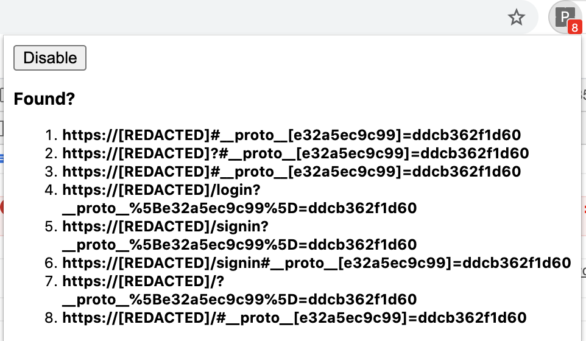

# PPScan

Client Side Protype pollution Scanner

### How to use?
2. Install addon 
3. Visit the websites you want to test

Currently, it only checks for vulnerable location parsers. 

### Issues
Have to bypass frame busting

``  
  window.self !== window.top && (window.top.location = window.location)
``

Check frame-busting-workaround branch, added window mode which creates windows instead of iframes