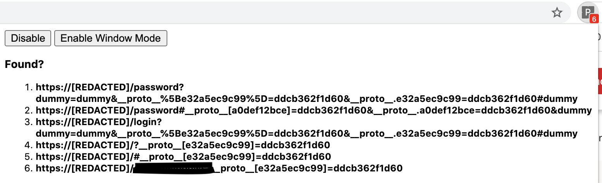
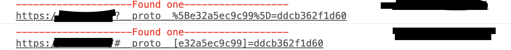

# PPScan

Client Side Protype pollution Scanner

### How to use?
2. Install addon 
3. Visit the websites you want to test

Window mode is useful when the application uses frame busting.

Currently, it only checks for vulnerable location parsers. 

